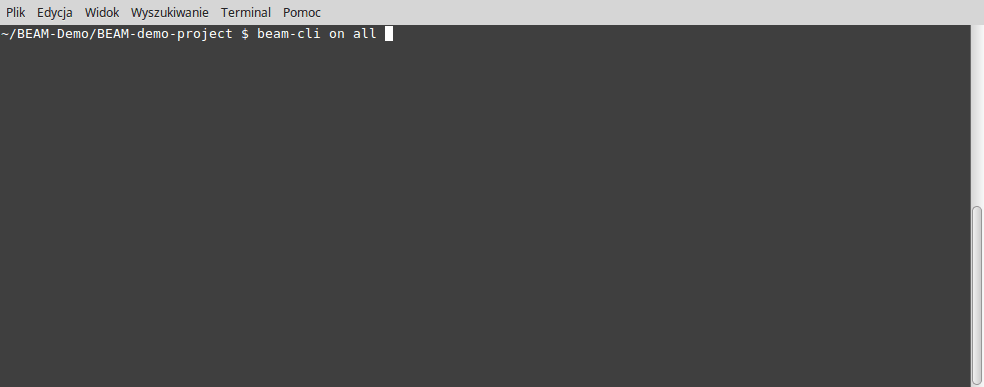

*Animation above presents how BEAM runs deploying its demo project. Duration: 5min*
 
---

# BEAM Framework

BEAM Framework is an Ansible-based solution addressed to anyone that develops projects using *server-side* components (like backends and frontends) and want to organize and manage all the *devops*-related things in better, more robust & productive and *life-easying* way (as BEAM is an acroym for **B***etter* **E***nvironments* **A***nsible-based* **M***anagement* ;)

Generally speaking, BEAM Framework may be used for doing anythig with linux/OS X/BSD/Windows-based hosts, but is mainly focused on *devops* tasks, like deployments, running UAT/SIT tests that has to be performed on stable, reproducible environments (even created on-the-fly for test lifetime only) etc.

To quickly introduce how BEAM Framework is going to help you after you *BEAMize* yourself, look below at those few examples of typical *devops* actions:

>Suppose you have a complex *project* **Colorful** that follows typical 3-tier architecture's approach with three independent *project components*: **Red** as a backend, **Green** as a frontend and **Blue** as a middleend. Project has also defined three environments: **develop**, **staging** and **production**...
>
>**Restarting whole *production* environment (all project components services)?**
```console
$ beam-cli on all @ production service restart all
```
> *How many times have you to restart multiple servers of runtime environment manually? With BEAM it's super easy task - just define services for all your project components inside your project, BEAM will handle the rest.*
>
>**...or maybe just a nginx for backend and frontend on *staging*?**
```console
$ beam-cli on Red,Green @ staging service restart nginx
```
> *Services and service actions are user-defined in per project component manner. And it's not only running "sudo service sth" - as services and it's actions you may define anything you need.*
>
>**Deploying the whole project (all its components) from repo tag *RELEASE_V2*  on *production* environment?**:
```console
$ beam-cli on all @ production deploy RELEASE_V2
```
> *Hey, look on that! Oneliner for whole project deployment, isn't that cool? ;)*
>
>**...or maybe just latest backend (from master branch) on *develop* environment?**:
```console
$ beam-cli on Red @ develop deploy master
```

And that's not all folks! Behind the CLI scene (used to run typical *devops* tasks), BEAM Framework also provides you:
 * technology-agnostic approach as your project components could be based on any technology/language and your environments can use any kind of infrastructure (standalone servers, PaaS/SaaS platforms etc) .
 * built-in validations of your job before it will be applied (eliminates many common commandline argument mistakes, playbooks syntax errors, configuration errors etc).
 * an unified, simple to setup and use, way of defining projects with its appropriate runtime environments (i.e develop/staging/production etc). Projects could aggregate many project components (related to projects, reusable across the projects) with manageable services, making it well-structured and easy to manage, maintenance & develop.

Due to (built-in *by design*) flexibility and extensibility, BEAM Framework may handle even complex configurations of project/components with many dependencies and customizations that may evolve during development. All this could be achieved just by utilizing few smart concepts and appropriate directory hierarchy structure on project/project components repositories, that keeps Ansible playbooks/roles and several project/components *ini-like config files* (used by BEAM to manage your projects/components).

Sounds good for you? Keep reading, start using and help making BEAM better!

## Table of Contents

- [Background](#background)
- [Installation](#installation)
- [Usage](#usage)
- [Demo](#demo)
- [Contribute](#contribute)
- [License](#license)
- [Release notes](#release-notes)
- [Credits](#credits)


## Background

As a backend developer, I used to spent a lot of time on development-related *devops* tasks, like environments setting up, deployments, managing develop/staging/production instances etc. Then I've discovered [Ansible](https://www.ansible.com/) and it makes all such tasks much more easier than before. Yup, Ansible is a great and famous IT automation tool for sure, but I missed there some high-level features, concepts and better integration with my company SW development process that would make my life simpler even more. So finally I came up with the conception of BEAM Framework that have addressed all my needs. As I believe such needs are not only mine and as BEAM is implemented and stable enough so I decided to share it with community :)

You may think about BEAM Framework as an *Ansible on steroids*. In fact, BEAM Framework uses Ansible internally as its *job-processing* engine and *data-definitions* source. It utilizes Ansible playbook/roles/environments almost directly, so you can easily reuse your existing playbooks/roles collection if you decide to BEAMize yourself.

Instead making you using Ansible's CLI tools for running playbooks, BEAM Framework introduces a wider *job* concept and provides a handy BEAM CLI *wrapper* tool for them. BEAM CLI makes typical *devops* tasks related to your projects/components (like deployments or managing services and infrastructures) much more easier, faster and more reliable - even for (or especially for) non-technical users without strong "Ansible background". You may use BEAM CLI in many places, not only *by hand* but also as a part of any existing automation solutions (i.e. CI servers like Jenkins, helping you making a lot of things much esasier).

But BEAM is not only a piece of software - it comes with some (lets's say;) innovate, fresh, authorial concepts and solutions, that makes BEAM unique and something more than just Ansible wrapper.

Also BEAM Framework comes with an extensible and growing library of ready-to-use *roles* components (conceptually similar to ansible galaxy roles, but built-in into framework), suitable for most common cases, that makes lot of *devops* tasks just rapid, trivial, lego-like assembling work.

## Requirements

Same as for [Ansible](http://docs.ansible.com/ansible/intro_installation.html#control-machine-requirements). In a nutshell:  currently Ansible can be run from any machine with Python 2.6 or 2.7 installed. Windows isn’t supported for the control machine (you can't run BEAM CLI from windows machines as Ansible does not support them too, but you can manage any windows hosts as well).

## Installation

BEAM does not require installation, it runs directly from cloned repo with little help of included setup script.

> REMARK: Setup script is assuming you're using a bash-compatible shell. If not please set up BEAM manually, according to setup script content (as this is very rare case used by power users I assume you know how to do it properly).

First, clone down the repository (for this example target destination is *~/BEAM-Framework* but you can clone it everywhere you want):

```console
$ cd ~
$ git clone git@github.com:inFullMobile/BEAM-Framework.git && cd BEAM-Framework
```
Next, you need to run BEAM setup script (sourced as below), which will take care of the rest (downloading proper Ansible version used exclusively by BEAM Framework as it does not use Ansible installed on your system, appending BEAM binaries path to your system path etc):

```console
$ cd beam/bin
$ source beam-setup

Setting up BEAM framework, please wait a minute...

BEAM setup has finished! Press any key to exit...
```

### Update
To update BEAM to latest version just pull latest code from BEAM repository master branch and re-run BEAM setup script. BEAM Framework repo has special tag LATEST_STABLE_VERSION you can just checkout. It's moved for every release to latest stable version. 

```console
$ cd ~/BEAM-Framework
$ git pull --rebase && cd /beam/bin
$ git checkout LATEST_STABLE_VERSION
$ source beam-setup
```

## Usage

Before you run your first BEAM  CLI commands, you have to spend a time to correctly BEAMize your projects and setup appropriate project repos, define environments, implement jobs.. *but wait, what are you talking about? ;)*


### Terms glossary

To let you fully understand the philosophy standing behind BEAM Framework, here is the list of basic concepts utilized by BEAM Framework.

Term name | Term description
--------- | ----------------
**host** | Any host accessible by SSH (or other method that Ansible is supporting) that may be used to host one or more project components or other manageable services (like databases, web servers etc).
**environment** | Set of hosts that makes an infrastructure required to run one or more project components (or even whole project). For example: *develop* environment may be fully hosted by one host, but *production* environment may define separate hosts (or even dynamically instantiated hosts for HA-class projects, started *on-demand* by autobalancers etc) for every component of project. Environment defines all hosts configuration.
**component** *(project component)* |  Code repository that contains project component payload (i.e. your backend or frontend source code files) and special config data files, required by BEAM to run such component on any host/environment. General rule for components: it defines "how" (in sense of jobs) i.e.: *How to perform given job?*, *How to interpret job's arguments* etc.
**project** | Code repository that contains project payload (if any - i.e. common project files, assets, documentation etc) and special config data required by BEAM that defines the project (all its components and all its environments). General rule for projects: it defines defines "where & what " (in sense of environments / components) - *Where project can be deployed (what are available environments to deploy project components)?* , *what components can be deployed (what components belongs to project)* etc.
**service** | Any entity with appropriate interface, hosted by hosts, which can be started, stopped or managed in any other way. Examples of services are nginx, postgres, django application or any of its aggregates. Services are defined by components.
**job** | Basic BEAM entity that represents set of tasks to be performed for any component (from project) on given environment. Jobs are defined by projects/components. Job is defined as ansible playbooks in appropriate manner (by putting appropriate playbooks into appropriate folders on project/component repos as shown below).
**role** | Reuable entity that represent encapsulated set of tasks and data, that can be used by Job playbooks. You can treat is as an equivalent of class from OOP world. BEAM roles are just ansible roles but with BEAM-aware additional requirements (i.e. understanding special BEAM variables and parameters structure passed by jobs). Roles are defined by BEAM Framework (built-in roles with global scope) or may be defined in project (project-related with project scope) or components (component-related roles with component scope).
**role actions** | Each role could have also additional *actions*, that are equivalent of methods in OOP world. Role could define actions and its parameters (that can be passed to role, which also takes care of its validation etc). So one role could handle many actions. That's the one of the most *cool* BEAM features - it provides possibility to create well-defined roles responsible for doing *anything* related to *one thing* (i..e a database server) - that's what Ansible totally missed to specify in well, common manner.

### Quickstart checklist

To use BEAM Framework, after its installation you have to:

1. Learn how to use BEAM CLI (and get overview of whole BEAM features).
2. BEAMize your project (put .BEAM directory with appropriate data on your project repository or create fresh project repository from provided template).
3. BEAMize your project components (put .BEAM directory with appropriate data on your project component repositories or create fresh project repository from provided template).
4. Define your environments in project repo.
5. Define any project jobs and roles.
6. Define any components jobs and roles.


### BEAM CLI

BEAM CLI is the *user interface* used to running given *jobs* for given *components* (from the project) on given *environments* as following:

```
beam-cli on <component(s)> @ <environment> run <job> <job_parameters>
```
where:

item|description
---|---
`<component(s)>`|ID of component(s) (one or more, coma separated) or special `all` ID that selects all components available in project.
`<environment>`|ID of environment defined by project.
`<job>`|ID oj job to be processed. BEAM Framework comes with two built-in job *classes* included: **deploy** and **service**, but projects/components may define its own job casses as well. Project/components must also provide a job classes implementation with appropriate actions and commands.
`<job_parameters>`|Any number of job parameters that will be passed to job. Job parameters are defined by job classes itself and it's a job implementation responsibility to correctly interprete passed parameters (basic validation may be performed by job classes).

> REMARK: **beam-cli** requires to be run from the root of project directory (on project for what you are going to run a job). If you try to run beam-cli from elewhere other it will complain loudly. So you always have to change PWD directory to appropriate one, before calling **beam-cli** like below:
```console
$ cd /your/clonned/project/repo/path
$ beam-cli <arguments>
```

## Built-in jobs

BEAM Framework is currently equipped with two most commonly *desired* jobs: *deploy* and *service*.

### deploy

The **deploy** job is intended to perform deploy of chosen project components.
```
beam-cli on <component(s)> @ <environment> run deploy <what>
```

available deploy job arguments:

item|description
---|---
`<what>`| What should be deployed: name git of branch, git tag or commit hash.

Some examples how to use deploy job:
>Deploying of *Red* project component (from its *master* branch) on *develop* environment:
```console
 $ beam-cli on Red @ develop run deploy master
```
>Deploying both *Green* and *Blue* project component (from its tag: *STABLE_V12*) on *staging* environment:
```console
$ beam-cli on Green,Blue @ staging run deploy STABLE_V12
```

### service

The **service** job is intended to run any kind of commands against services defined by project/components.
```
beam-cli on <component(s)> @ <environment> run service <command> <services>
```

available job arguments:

item|description
---|---
`<command>` | Service command to run (defined by project and/or  project components).
`<services>` | List of services (one or more, coma separated) defined by project/components for what given command will be run.

Some examples how to use service job:
>Restart of django application and database services of *Blue* project component on *staging* environment:
```console
$ beam-cli on Blue @ staging service restart django_app,database
```
>Stop Django application of *Blue* project component on *staging* environment
```console
$ beam-cli on Blue @ staging service stop django_app
```
## Built-in roles

BEAM Framework comes with roles library for many typical components. List of all roles provided by BEAM Framework (refer to appropriate role for its documentation):

* [beam.compass](/beam/roles/beam-roles-library/beam.compass) - Compass SCSS support.
* [beam.django](/beam/roles/beam-roles-library/beam.django) - Django support.
* [beam.git](/beam/roles/beam-roles-library/beam.git) - Git support.
* [beam.include-yml-files](/beam/roles/beam-roles-library/beam.include-yml-files) - Includes given yml files with tasks from given directory into current playbook.
* [beam.instance-common](/beam/roles/beam-roles-library/beam.instance-common) - Common instance goodies support.
* [beam.nginx](/beam/roles/beam-roles-library/beam.nginx) - Nginx server support.
* [beam.nodejs](/beam/roles/beam-roles-library/beam.nodejs) - NodeJS support.
* [beam.postgresql](/beam/roles/beam-roles-library/beam.postgresql) - PostgreSQL support.
* [beam.python](/beam/roles/beam-roles-library/beam.python) - Python support.
* [beam.ruby](/beam/roles/beam-roles-library/beam.ruby) - Ruby support.

### Project

In the BEAM world, project defines what components are part of project, all environments structure, it may provide special project jobs (common jobs that are called for every job, before project jobs) and its roles. It has hierarchical structure to keep all the things in one place, what simplifies a lot and allows coexistence (in one directory) of separate projects that uses same components (i.e. customized projects with different assets etc).

 BEAM recognises that repo is a project by presence of *project.conf* file in the root of repo .BEAM directory. This special configuration file provides to BEAM some required info about the project:
 * **project name** - used as project ID for beam-cli calls and by roles to perform some tasks (i.e. uses it for default directory names etc).
 * **project description** - put there any human-readable description sentence (may be multilines) for better info purposes
 * **project repo SSH url** - that's how BEAM is able to gather your repos (i.e. for deploying purposes)
 * **project components list** - list of all project components (and its repo urls) that are a part of the project - that's how beam is able to apply a job for *all* project components).

#### Project repo setup

Below you can see the BEAMized structure of project repository - only repos with such structure and content are compatible with BEAM Framework and can be processed by it properly (of course it's validated by BEAM during runtime)

```
Colorful               # Project repository root directory (named Colorful here).
├── .BEAM              # Special directory for all project-specific data required by BEAM Framework.
│   ├── environments   # Environments directory (subdirs nams are an environment IDs).
│   │   ├── develop    # This directory defines develop environment (must contain proper ansible inventory structure with host file).
│   │   ├── staging    
│   │   └── production
│   ├── jobs           # (optional) For storing project jobs (common for whole project, runned for every project component).
│   │   ├── setup      # setup job (i.e. custom job that makes initial setup for project instance).
│   │   └── deploy     # deploy job (with tasks that will be run everytime any project component will be deployed).
│   ├── roles          # Reusable roles (encapsulating tasks and data) that can be used by all project jobs.
│   └── project.conf   # Project configuration file that defines project's ID, projects used by project, project repo link etc.
├── project_components # Here you have to clone all project components repositories used by project.
└── <anything>         # Other project-speific files & directories i.e. assets, documentation etc).
```
To save your time, there is a ready-to-use, well-commented template of [Project repo](https://github.com/inFullMobile/BEAM-project-template) containing appropriate directories structure and template of *project.conf* - just copy the .BEAM directory from there to your component repo and fill all template variables with appropriate values - as described in comments.

#### Environments

Every environment is just an Ansible inventory structure (with host inventory file, group_vars / host_vars directory etc), so please refer to [Ansible documentation](http://docs.ansible.com/ansible/intro_inventory.html) about that how to prepare it correctly.

#### Roles and jobs

If you define jobs in your project repo just remember that it will be run for any project component (if name of the project role is the same as passed during BEAM CLI call). Project jobs can be used for some common actions that have to be run before component jobs (.e. define deploy job in project and put all common actions there - it will be run before job deploy defined in your components).

For better structuring complex configurations, you can define also roles (that are reusable entities encapsulating tasks and data) and use it inside your project job playbooks.

### Component (project component)

BEAM utilizes a *project components* as a key concept how projects are organized. Every project can have one or more components (a component repos) and yes - components may be fully reusable between projects (if you make them reusable of course).

BEAM recognises that repo is a project component by presence of *component.conf* file in the root of repo *.BEAM* directory. This special configuration file provides to BEAM some required info about the component:
 * **component name** - used as component ID for beam-cli calls and by roles to perform some tasks (i.e. uses it for default directory names etc).
 * **component description** - put there any human-readable description sentence (may be multilines) for better info purposes
 * **component repo SSH url** - that's how BEAM is able to gather your repos (i.e. for deploying purposes)

#### Component repo setup

Below you can see the BEAMized structure of component repository - only repos with such structure and content is compatible with BEAM Framework and can be processed by it properly (of course it's validated by BEAM during runtime).

```
Blue                  # Project component repository root directory (named Blue here)
├── .BEAM             # Special directory for all component-specific data required by BEAM Framework.
│   ├── jobs          # (optional) Storing component jobs, that component must define and implement.
│   │   ├── foo       # foo job (i.e. custom job that makes.. anything you need to).
│   │   ├── service   # service job (with component services definitions).
│   │   └── deploy    # deploy job (with tasks that will be run everytime any component will be deployed).
│   ├── roles         # Reusable roles (encapsulating tasks and data) that can be used by this component jobs.
│   └── component.conf  # Component configuration file that defines component ID, component repo link etc.
└── <anything>        # Other component-speific files & directories i.e. backend or frontend application files like Django or Angular.
```

To save your time, there  is a ready-to-use, well-commented template of [BEAM Component repo](https://github.com/inFullMobile/BEAM-project-component-template) containingns appropriate directories structure and template of *component.conf* - just copy the .BEAM directory from there to your component repo and fill all template variables with appropriate values - as described in comments.

#### Roles and jobs

You have to implement your jobs for every project component if needed. This means if your component needs *deploy* job, you have to prepare appropriate playbooks that defines how to make deploy. If your component utilizes *service* job, you have to define service job with all needed services and task to handle needed service commands.

For better structuring complex configurations, you can define also roles (that are reusable entities encapsulating tasks and data) and use it inside your component job playbooks.

## Demo

BEAM Framework comes with a demo to let you quickly see "what's going on" on real life example.

The demo is an simple "online python interpreter" web application. (just like [this one](http://mathcs.holycross.edu/~kwalsh/python/)). It contains 3 repositories:
* [project repo](https://github.com/inFullMobile/BEAM-demo-project) that defines two environments: develop (one host) and production (3 separate hosts for frontend, backend and db).
* [backend component repo](https://github.com/inFullMobile/BEAM-demo-backend) based on Django
* [frontend component repo](https://github.com/inFullMobile/BEAM-demo-frontend) - an Angular SPA app

Both demo components contains deploy and service jobs implementation, so you can easily see "how it works", try it by yourself etc. Deployment is done on your localhost vagrant-based environments (deploy jobs fully takes care on it, no additional setup needed, just have vagrant & virtualbox installed). For more informations please refer to repos README files. 

To setup demo properly you have to:
* install Beam Framework (as described above)
* in your home directory create BEAM-Demo directory (sorry for fixed directory location - it just makes things easier;)
* clone demo project repo into ~/BEAM-Demo directory
* clone both demo project component repos inside /components directory located in root of project repo

Now you have to run deploy for every environment you wish to use i.e.:

```console
$ beam-cli on all @ develop run deploy master
```
After successful deployment (it takes several minutes on first time as vagrant boxes has to be downloaded and vagrant machines hs to be created), open your browser at http://192.168.33.10/ to play with web app.

## Contribute

We would love to see your contributions to BEAM Framework project!
Please use the issue tracker to report any bugs or feature requests, PRs are welcome.


## License

[MIT © Krystian Rembas / inFullMobile](LICENSE)


## Release Notes

Current version is: 0.9

REMARK: versions below 1.0 should be concidered as experimental & non-stable, you're using it on your own risk ;)

### v0.9

First released version. Experimental & unstable - some things may unexpectedly change ;)

Ansible engine version used by BEAM Framework:  v2.2.0.0-1


## Credits

 Thanks for everyone who took part in supporting BEAM project origin and development, especially to:
 * [@inFullMobile](https://github.com/inFullMobile) company that paid for hours I spend on BEAM development and let me release it as open source :)
 * [@mwilkosinski](https://github.com/mwilkosinski) who prepared BEAM-Demo-Frontent project component that presents how BEAM can play with deployment of modern frontend apps.

